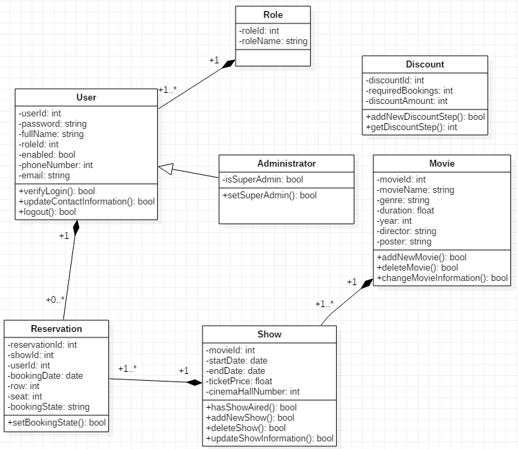

# Biograf Bio B webapplikation

**Indledning**

B Bio skal have et nyt website til at administrere forestillinger og til at håndtere salg af billetter til deres kunder. De ter vigtigt for B Bio at få deres kunder registreret i deres eget system. Kunden bliver derved ikke fristet af film, der vises i andre biografer. Og det gør det nemmere for kunden, at bestille billetter til flere forestillinger. Udover at kunden selv kan vedligeholde egne data, skal Bio B også have mulighed for at vedligeholde kunder i kundebasen

**Krav**

Der er følgende overordnede krav til websitet/løsningen.

- Bio B skal kunne oprette, redigere og nedlægge følgende: Kommende film, aktuelle film, sale samt oprette forestillinger hvor film og sal indgår. Dette arbejde udføres af en Bio B medarbejder, der skal være logget ind. Det skal være muligt at differentiere adgangen, så oprettelse af forestillinger kræver særlig fuldmagt
- Kunder skal kunne oprette dem selv som bruger, logge ind, redigere deres data, se tilgængelige forestillinger, bestille billetter, få listet historik, optjene rabatter, og selv kunne administrere deres bestillinger

**Systembesrkivelse**

- Verdensbillede
  - 
  - Hardware
    - CPU: 2 x Intel Xeon E5-2670
    - CPU køler: 2 x Noctua NH-U12DXi4
    - RAM: Hynix 128GB 16x8GB PC3–12800R
    - Bundkort: ASRock E2C602–4L/D16
    - SSD: Samsung EVO 500GB
    - PSU: Corsair RM1000X
    - Kabinet: Fractal Design Define XL R2
  - Software
    - Microsoft SQL Server
    - ASP.Net Core 2.1
    - Entity Framework Core

**Programmets funktion**

- Grundigere beskrivelse
  - Moderne web applikation til Bio B biografen. Admin portal som giver Bio B personale mulighed for, at oprette, redigere og slette forestillinger, sale samt film. Der er 2 typer portal brugere, kun-se-brugere og adgang-til-alt brugere, så Bio B selv kan vælge hvilke medarbejdere der skal kunne oprette, redigere og slette. Desuden skal personalet have mulighed for, at validere en billet, tjekke betaling og status via admin portalen, samt refundering og ændring af status. Kunder skal have deres egen portal, hvor de kan se deres tidligere bestillinger, ændre på en igangværende bestilling og se hvilket rabattrin de er på. Kunder går ét rabattrin op, for hver 10 gennemførte bestillinger. Kunder skal kunne slette deres konto og ændre på deres kontaktinformation. Bio B personale skal også kunne ændre i kundens informationer, f.eks. i tilfælde hvor kunden foretrækker ikke at gøre det selv.

- UML diagram
  - 

| ID and Name       | 1 - Test                             |                 |            |
| ----------------- | ------------------------------------ | --------------- | ---------- |
| Created by        | Virtus                               | Date Created    | 30.10.2018 |
| Primary actor     | Besøgende på Bio B siden             | Secondary actor |            |
| Description       | Brugeren skal købe en billet         |                 |            |
| Trigger           | Brugeren klikker på en film på siden |                 |            |
| Preconditions     |                                      |                 |            |
| Postconditions    |                                      |                 |            |
| Normal flow       |                                      |                 |            |
| Alternative flow  |                                      |                 |            |
| Exceptions        |                                      |                 |            |
| Priority          |                                      |                 |            |
| Frequence of use  |                                      |                 |            |
| Business rules    |                                      |                 |            |
| Other information |                                      |                 |            |
| Assumptions       |                                      |                 |            |

